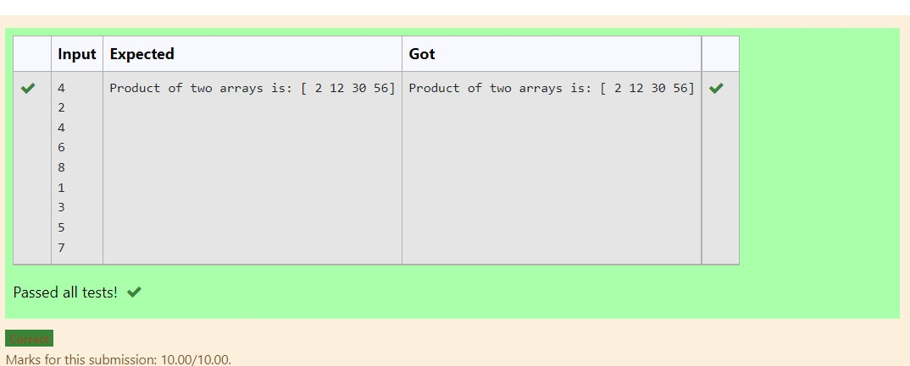

# Multiplying-two-matrix

## AIM:
to write a python program for multiplying two matrix.

## ALGORITHM:

### Step 1:
Use import numpy as np
### Step 2:
Enter the input
### Step 3:
Use append()
### Step 4:
use to multiply two matrix

### Step 5:

print.
## PROGRAM: 
~~~
import numpy as np
num1,num2=[],[]
n=int(input())
for i in range(n):
    num1.append(int(input()))
for i in range(n):
    num2.append(int(input()))
value1=np.array(num1)
value2=np.array(num2)
result=value1*value2
print("Product of two arrays is:",result)
~~~
## OUTPUT:

## RESULT:

